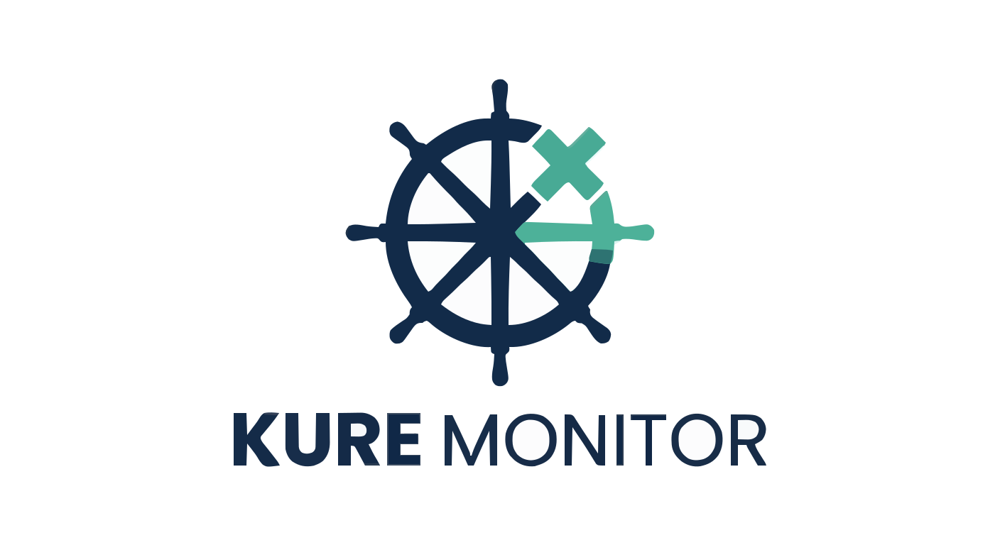

# Kure Monitor — Kubernetes Failure Diagnosis & AI Assistant for Grafana



**Kure Monitor** is a powerful Grafana App Plugin designed to proactively detect Kubernetes pod failures and provide instant, AI-driven root-cause analysis and actionable remediation steps—right inside your operational dashboards.

---

## 🌟 Key Features

1. **Real-Time Failure Feed & Pod Monitoring**
   - Automatically monitors and highlights pods in critical failure states, including:
     - `CrashLoopBackOff`
     - `ImagePullBackOff`
     - `Pending`
     - `OOMKilled`
     - `Evicted`
     - `RunContainerError` / `CreateContainerError`
     - `NodeLost`
   - View structured failure reasons, exit codes, restart counts, and recent container logs in a clean, unified feed.

2. **Interactive AI Chatbot Troubleshooting**
   - Direct integration with your Kure Monitor backend to analyze pod manifests, events, and log tails using advanced LLMs (OpenAI, Anthropic, Gemini, or custom providers).
   - Ask conversational questions about failing pods (e.g., *"Why did this container OOMKill?"* or *"What does exit code 137 mean here?"*) and receive immediate, context-aware remediation commands.

3. **Persistent Troubleshooting History**
   - A dedicated **History Tab** stores past troubleshooting sessions and AI diagnoses.

4. **Secure & Multi-Tenant Architecture**
   - Communicates securely with your Kure FastAPI backend using custom `X-Service-Token` headers.
   - Built-in user and workspace isolation ensures that cluster logs and AI chat histories remain strictly segregated and protected.

---

## 🚀 Getting Started

### 0. Local Setup
- [kubectl](https://kubernetes.io/docs/tasks/tools/)
- [docker](https://docs.docker.com/engine/install/) - In case of use other container engine, please update the "local_setup/local_setup.sh" script ( right now it's building image with docker ).
- [Install helm](https://helm.sh/docs/intro/install/)
- [Install kind](https://kind.sigs.k8s.io/docs/user/quick-start/)
- Execute setup script:
```shell
cd local_setup
chmod +x local_setup.sh
./local_setup.sh
```

### 1. Prerequisites
- [Kure Monitor](https://artifacthub.io/packages/helm/kure-monitor/kure)

### 2. Installation
* In grafana go to Administration -> Plugins and data -> Plugins.
* In search box type "Kure".
* First you will have to enable the plugin ( up right corner click "enable" button).

### 3. Configuration
1. In Grafana, go to **Administration -> Plugins -> Kure Monitor**.
2. Click on the **Configuration** tab.
3. Enter your **Kure Monitor Backend API URL** (e.g., `http://kure-backend.kure-system.svc:8000`).
4. Enter your **Service Token** (matching the `SERVICE_TOKEN` configured in your Kubernetes cluster):
   1. In kure-system namespace you will find kure-bootstrap secret.
   2. Use service-token value and copy/paste it in API Key on Grafana API Settings.
5. Click **Save & Test** to verify connectivity.

---

## 📚 Documentation & Support

- **GitHub Repository:** [https://github.com/igor-koricanac/kuremonitor-kure-app](https://github.com/igor-koricanac/kuremonitor-kure-app)
- **Support:** [igor.koricanac@gmail.com](igor.koricanac@gmail.com)

---

## 📄 License
This plugin is licensed under the **Apache License 2.0**. See the [LICENSE](https://github.com/igor-koricanac/kure-monitor/blob/main/LICENSE) file for details.
Copyright © 2026 Igor Koricanac. All rights reserved.
